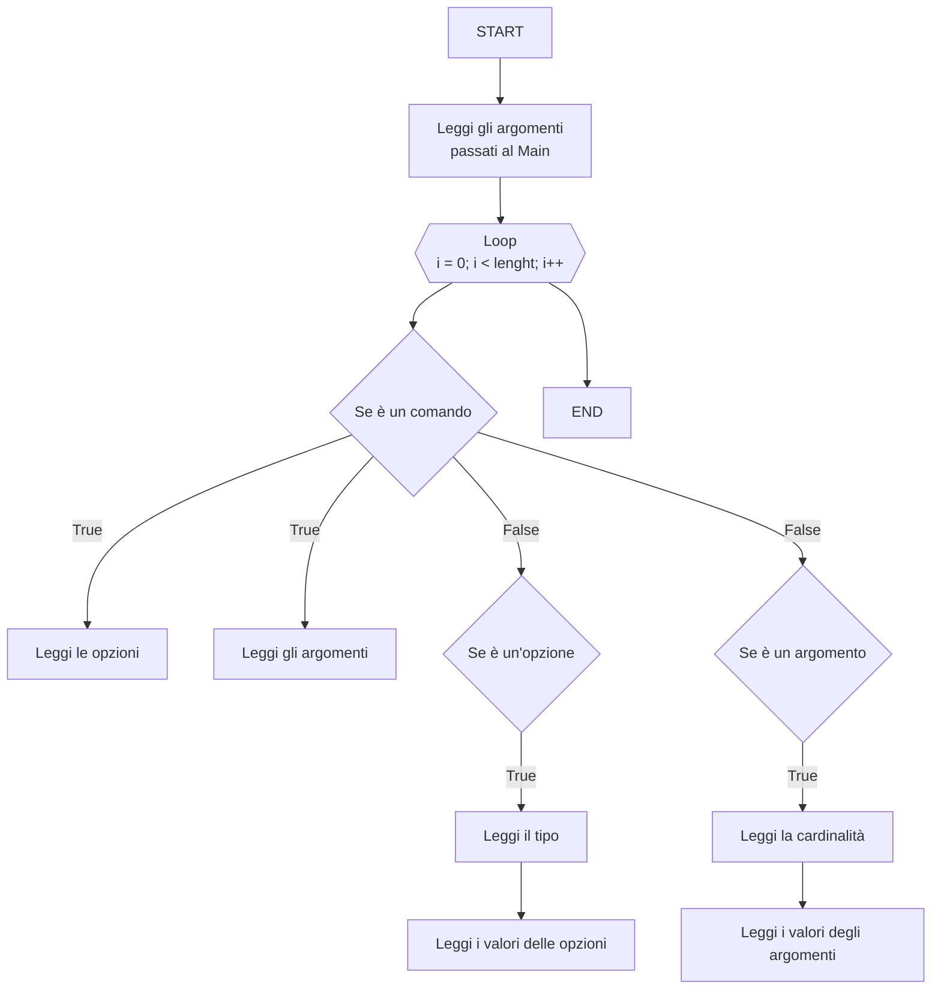

# ArgsAnalyzer

## Obiettivo

Lo scopo di questo progetto è di realizzare una personale libreria per l'analisi dell'array `args` passato al `Main` durante la fase di avvio del programma.

## Fasi di analisi

1. Lettura dell'array e conversione in una lista di stringhe
2. Analisi delle stringhe per identificare i (sub)Comandi, Argomenti e Opzioni
3. Creazione di una struttura dati per memorizzare i dati estratti
4. Implementazione di metodi per l'accesso ai dati estratti

## Comando

Un comando è una stringa che non necessariamente inizia con il carattere `-`. Un comando può essere composto da più parole separate da spazi.
Le proprietà di un comando sono:

- `Name`: Nome dell'applicazione
- `Description`: la descrizione dell'argomento
- `CommandName`: il nome del comando
- `arguments`: gli argomenti del comando
- `options`: le opzioni del comando

## Argomento

Un argomento è una stringa che non inizia necessariamente con il carattere `-` o `--`. Un argomento può essere composto da più parole separate da spazi e seguito da uno o più valori.
Le proprietà di un argomento sono:

- `Name`: il nome dell'argomento
- `Aliases`: gli alias dell'opzione
- `Description`: la descrizione dell'argomento
- `Cardinality`: la cardinalità dell'argomento ovvero il numero di valori che può assumere. Questa può essere:
  - `0`: l'argomento non ha valori
  - `1`: l'argomento ha un solo valore
  - `*`: l'argomento può avere più valori
- `Values`: i valori dell'argomento
- `Flag`: l'argomento è un flag e restituisce `true` se è presente

## Opzione

Un'opzione è una stringa che inizia con il carattere `-` o `--`. Un'opzione può essere composta da una sola parola. Una opzione può essere seguita da un valore oppure no. Le propeirtà sono:

- `Name`: il nome dell'opzione
- `Aliases`: gli alias dell'opzione
- `Description`: la descrizione dell'argomento
- `Flag`: l'opzione è un `flag =  true` se basta la sua presenza nell'array degli argomenti oppure `flag =  false` se necessita di un valore.
- `Value`: se l'opzione ha un valore questo viene valorizzato

# Gerarchia dei comandi

- `RootCommand`: il comando principale, quello che funziona digitando il nome dell'eseguibile. Ha come opzioni di default: `--help` e `--version`.
    > Può avere altre opzioni
    > Può avere argomenti
    - `SubCommand`: un comando che può essere eseguito solo dopo il comando principale. Ha come opzioni di default: `--help`.
        > Può avere opzioni
        > Può avere argomenti
        > Può avere subcomandi

Il comando quindi dovrà avere un metodo che gli consenta di aggiungere altri sub comandi, argomenti e opzioni. 
Ogni comando inoltre dovrà avere un metodo che gli consente di restiutire i valori delle opzioni e degli argomenti.

# Argoritmi necessari

Serve un algoritmo che scorra la lista di stringhe e identifichi i comandi, gli argomenti e le opzioni. Quando incontra un comando deve analizzare cosa viene dopo in base alla configurazione di quel comando. Se incontra un'opzione deve analizzare se è un flag o un'opzione con valore e se è presente un valore. Se incontra un argomento deve analizzare se è un argomento con valore o meno e se è presente un valore, o più di uno.

Una volta ricavate le informazioni immagazzinarle in una struttura dati che permetta di accedere facilmente ai dati.

## FlowChart

